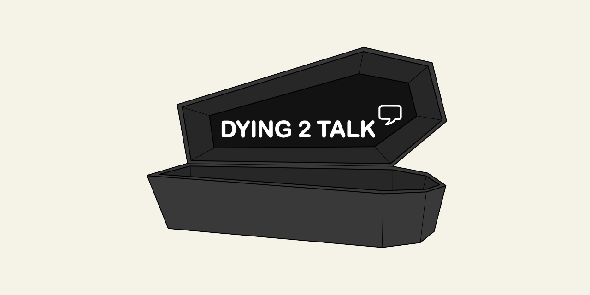

# Dying 2 Talk

This project results from a partnership between the Universities of Bradford and Wolverhampton and Child Bereavement UK. Funded by AHRC (Arts and Humanities Research Council), it aimed to co-produce resources with young people – for young people – to prompt conversations about death, dying and bereavement.

Visit the website here: [https://dying2talk.org/](https://dying2talk.org/)

## Getting Started

This project has been built with [TypeScript](https://www.typescriptlang.org/) and [SCSS](https://sass-lang.com/).

 1) Clone GitHub repository
 2) Install packages (`npm i`)
 3) Start bundler (`npm run start`)

## Deployment

The website is hosted on [Cloudflare](https://www.cloudflare.com/) and uses CI to ease deployment. Simply create a new commit in the `release` branch to deploy.

**Note:** The output versions are based on the version in the `package.json`. Using `npm version patch/minor/major` is recommended to bump this.

## Contact

If you have questions, please contact on Twitter ([@Dying_Talk](https://twitter.com/Dying_Talk)) or e-mail ([dyingtotalkproject@gmail.com](mailto:dyingtotalkproject@gmail.com))
